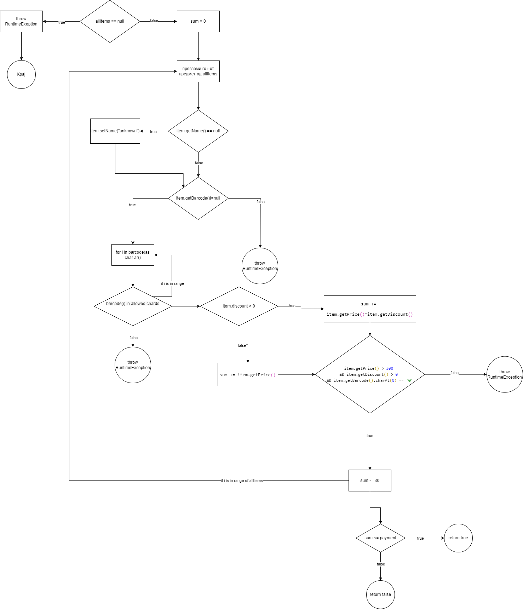

# SI_2024_lab2_223052
Марија Цветановска 223052
2.

3. Формула за пресметување на цикломатска комплексност:
    V(G)=E−N+2P каде
    Е- број на ребра (23)
    P- број на функции (1)
    N- број на јазли    (21)
    V(G)= 23 - 21 + 2*1
    V(G)=4
    Добиваме дека цикломатската комплексност изнесува 4. 
4. Документација за тест случаите со користење на Еvery Branch критериумот
- allItems == null:
  - Овој тест случај проверува дали методот правилно фрла исклучок кога листата на предмети е null.
- item.getName() == null:
  - Овој тест случај проверува дали методот правилно ја поставува вредноста на името на предметот на "unknown" кога името е null.
- item.getName().length() == 0:
  - Овој тест случај проверува дали методот правилно ја поставува вредноста на името на предметот на "unknown" кога името е празен стринг.
- item.getName() != null && item.getName().length() > 0:
  - Овој тест случај проверува дали методот функционира нормално кога името на предметот е валидно.
- item.getBarcode() != null, валиден баркод:
  - Овој тест случај проверува дали методот правилно пресметува сумата кога баркодот е валиден.
- item.getBarcode() != null, невалиден баркод:
  - Овој тест случај проверува дали методот правилно фрла исклучок кога баркодот содржи недозволени карактери.
- item.getBarcode() == null:
  - Овој тест случај проверува дали методот правилно фрла исклучок кога баркодот е null.
- item.getDiscount() > 0:
  - Овој тест случај проверува дали методот правилно ја пресметува сумата кога предметот има попуст.
- item.getDiscount() <= 0:
  - Овој тест случај проверува дали методот правилно ја пресметува сумата кога предметот нема попуст.
- item.getPrice() > 300 && item.getDiscount() > 0 && item.getBarcode().charAt(0) == '0':
  - Овој тест случај проверува дали методот правилно го намалува попустот за 30 кога предметот е поскап од 300, има попуст и баркодот започнува со '0'.
- sum <= payment:
  - Овој тест случај проверува дали методот враќа true кога сумата на сите предмети е помала или еднаква на платената сума.
- sum > payment:
  - Овој тест случај проверува дали методот враќа false кога сумата на сите предмети е поголема од платената сума.
5. Документација за тест случаи според Multiple condition критериумот
- item.getPrice() <= 300:
  - Овој тест случај проверува дали методот работи правилно кога цената на предметот е под или еднаква на 300.
- item.getDiscount() <= 0:
  - Овој тест случај проверува дали методот работи правилно кога попустот на предметот е 0 или под 0.
- item.getBarcode().charAt(0) != '0':
  - Овој тест случај проверува дали методот работи правилно кога првиот карактер од баркодот не е '0'.
- item.getPrice() > 300 && item.getDiscount() > 0 && item.getBarcode().charAt(0) == '0':
  - Овој тест случај проверува дали методот работи правилно кога сите услови за попуст, цена и баркод се исполнети.